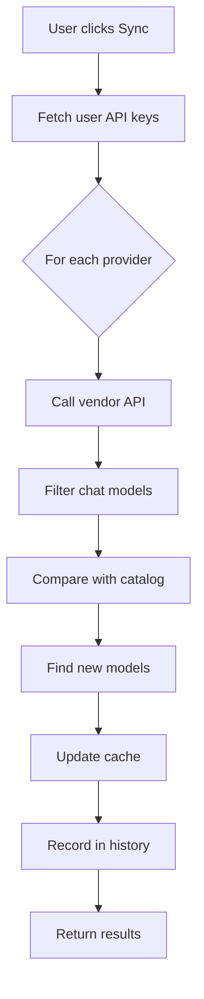

# Model Auto-Sync System

Automatic synchronization of AI models from vendor APIs to keep your model catalog up-to-date.

## 🎯 Features

- ✅ **Auto-fetch** latest models from OpenAI, Anthropic, Groq, Google
- ✅ **Smart detection** of new models not in catalog
- ✅ **Automatic cache update** in database
- ✅ **Sync history** tracking
- ✅ **Manual trigger** via UI button
- ✅ **Cron-ready** for monthly auto-sync

## 📁 Files

### API Endpoint
- `frontend/src/app/api/models/sync/route.ts` - Sync API
  - `POST /api/models/sync` - Trigger sync
  - `GET /api/models/sync` - Get last sync status

### UI Component
- `frontend/src/components/admin/ModelSyncButton.tsx` - Sync button for Profile page

### Database
- `supabase/migrations/014_create_model_sync_history.sql` - Sync history table

### Model Catalog
- `frontend/src/lib/models/modelCapabilities.ts` - Source of truth for model metadata

## 🚀 Setup

### 1. Run Migration

```bash
# Apply the migration to create model_sync_history table
cd supabase
supabase db push
```

Or manually run the SQL:
```sql
-- Run: supabase/migrations/014_create_model_sync_history.sql
```

### 2. Add Sync Button to Profile Page

```tsx
// In frontend/src/app/profile/page.tsx
import ModelSyncButton from '@/components/admin/ModelSyncButton'

export default function ProfilePage() {
  return (
    <div>
      {/* ... existing profile content ... */}
      
      {/* Add this section */}
      <div className="mt-8">
        <ModelSyncButton />
      </div>
    </div>
  )
}
```

### 3. Test Manual Sync

1. Go to Profile page
2. Click "🔄 Sync Now" button
3. Wait for results
4. Check for new models in dropdown

## 🔄 How It Works

### Sync Process



### Provider-Specific Logic

#### OpenAI
- Endpoint: `https://api.openai.com/v1/models`
- Filters: Excludes embeddings, TTS, DALL-E, Whisper
- Returns: All GPT and o1 models

#### Groq
- Endpoint: `https://api.groq.com/openai/v1/models`
- Filters: Excludes Whisper, Guard, embeddings
- Returns: All Llama, Mixtral, Gemma models

#### Google
- Endpoint: `https://generativelanguage.googleapis.com/v1beta/models`
- Filters: Only Gemini models with `generateContent` support
- Returns: All Gemini models

#### Anthropic
- No public models list endpoint
- Uses known model list
- Future: Test each model with small request

## 📊 Database Schema

```sql
CREATE TABLE model_sync_history (
  id UUID PRIMARY KEY,
  user_id UUID REFERENCES auth.users(id),
  sync_results JSONB,  -- Full sync results from all providers
  total_new_models INTEGER,
  synced_at TIMESTAMPTZ,
  created_at TIMESTAMPTZ
);
```

## 🤖 Cron Job Setup (Optional)

### Vercel Cron

Add to `vercel.json`:

```json
{
  "crons": [
    {
      "path": "/api/models/sync/cron",
      "schedule": "0 0 1 * *"
    }
  ]
}
```

Create `frontend/src/app/api/models/sync/cron/route.ts`:

```typescript
import { NextRequest, NextResponse } from 'next/server'
import { createClient } from '@/lib/supabase/server'

export async function GET(request: NextRequest) {
  // Verify cron secret
  const authHeader = request.headers.get('authorization')
  if (authHeader !== `Bearer ${process.env.CRON_SECRET}`) {
    return NextResponse.json({ error: 'Unauthorized' }, { status: 401 })
  }

  // Get all users with active API keys
  const supabase = await createClient()
  const { data: users } = await supabase
    .from('user_api_keys')
    .select('user_id')
    .eq('is_active', true)
  
  // Sync for each user
  const results = []
  for (const user of users || []) {
    // Call sync endpoint for this user
    // ... implementation
  }

  return NextResponse.json({ synced: results.length })
}
```

### GitHub Actions

Create `.github/workflows/model-sync.yml`:

```yaml
name: Monthly Model Sync

on:
  schedule:
    - cron: '0 0 1 * *'  # 1st of every month
  workflow_dispatch:  # Manual trigger

jobs:
  sync:
    runs-on: ubuntu-latest
    steps:
      - name: Trigger Model Sync
        run: |
          curl -X POST https://your-domain.com/api/models/sync/cron \
            -H "Authorization: Bearer ${{ secrets.CRON_SECRET }}"
```

## 📈 Monitoring

### Check Sync Status

```typescript
// In your app
const response = await fetch('/api/models/sync')
const { lastSync, needsSync } = await response.json()

if (needsSync) {
  // Show "Sync recommended" banner
}
```

### View Sync History

```sql
-- Get recent syncs
SELECT 
  synced_at,
  total_new_models,
  sync_results
FROM model_sync_history
WHERE user_id = 'user-id'
ORDER BY synced_at DESC
LIMIT 10;
```

## 🎨 UI Integration

### Show "New Models" Badge

```tsx
// In OrchestratorPanel.tsx
const [hasNewModels, setHasNewModels] = useState(false)

useEffect(() => {
  fetch('/api/models/sync')
    .then(res => res.json())
    .then(data => {
      if (data.lastSync?.total_new_models > 0) {
        setHasNewModels(true)
      }
    })
}, [])

// In UI
{hasNewModels && (
  <span className="px-2 py-1 bg-green-100 text-green-700 text-xs rounded">
    New models available!
  </span>
)}
```

## 🔧 Troubleshooting

### Sync Fails

1. **Check API keys**: Ensure keys are active and valid
2. **Check rate limits**: Vendor APIs may have rate limits
3. **Check network**: Ensure server can reach vendor APIs
4. **Check logs**: View console for detailed errors

### New Models Not Showing

1. **Clear cache**: Refresh the page
2. **Check catalog**: Ensure `modelCapabilities.ts` is updated
3. **Check `getCanonicalModel()`**: Add patterns for new models

### Sync History Not Saving

1. **Check migration**: Ensure table exists
2. **Check RLS**: Ensure policies allow inserts
3. **Check auth**: Ensure user is authenticated

## 📝 Future Enhancements

- [ ] **Auto-sync on login** (if > 30 days since last sync)
- [ ] **Email notifications** when new models found
- [ ] **Model changelog** showing what changed
- [ ] **Automatic catalog updates** (write to `modelCapabilities.ts`)
- [ ] **Model testing** (test each new model with sample request)
- [ ] **Cost tracking** (estimate costs for new models)
- [ ] **Deprecation warnings** (detect when models are removed)

## 🤝 Contributing

To add a new provider:

1. Add sync function in `route.ts`:
   ```typescript
   async function syncNewProvider(apiKey: string): Promise<SyncResult> {
     // Fetch models from API
     // Filter for chat models
     // Return result
   }
   ```

2. Add to switch statement:
   ```typescript
   case 'newprovider':
     result = await syncNewProvider(key.api_key)
     break
   ```

3. Update `ModelSyncButton.tsx` if needed

## 📚 Resources

- [OpenAI Models API](https://platform.openai.com/docs/api-reference/models)
- [Groq Models](https://console.groq.com/docs/models)
- [Google Gemini Models](https://ai.google.dev/gemini-api/docs/models/gemini)
- [Anthropic Models](https://docs.anthropic.com/claude/docs/models-overview)

